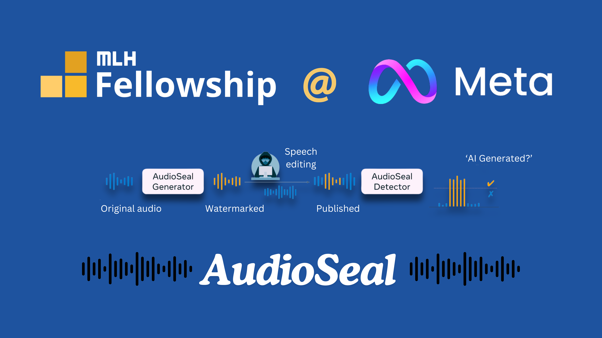

# 🎓 **MLH Fall 2024 Fellowship - Report**

## 🌟 **Project Overview**

During the MLH Fall 2024 Fellowship, I was assigned to work on improving Meta's open-source project, [**AudioSeal**](https://github.com/facebookresearch/audioseal), which focuses on audio watermarking using deep learning models. The project primarily involved creating training recipes, evaluating model performance, and contributing to the overall project documentation. I also focused on implementing and testing various elements of the project to enhance its capabilities, making significant strides in improving the quality and usability of AudioSeal. 🚀

## 🛠️ **Tasks Undertaken and Work Completed**

### 1. **AudioSeal Development** 🗣️🎶

- **Training Recipes**: One of my key tasks was to develop a new training recipe using a public audio dataset, such as **LibriSpeech**. I started by exploring the existing structures in the AudioSeal repository and modifying the pipeline to create a comprehensive training grid. This involved understanding the intricate interactions between **AudioCraft**, **Dora** and **AudioSeal**, and carefully setting up effective parameter configurations to optimize the training process. 💡

- **Custom Grid Search with Dora**: To achieve the best possible model performance, I learned and utilized the **Dora** tool for complex hyperparameter tuning. This allowed me to identify the optimal parameter combinations for the AudioSeal model, resulting in significant performance gains. Mastering Dora was an exciting challenge, as it pushed me to delve deep into advanced hyperparameter optimization techniques. 🔍

- **Custom Watermarking Model Training & Evaluation Notebook**: I created a few custom training notebooks specifically for training and evaluating watermarking model. These notebook provides a detailed step-by-step guide on setting up the model, configuring the dataset, and executing the training process. These notebooks is designed to be highly interactive, allowing users to experiment with various configurations and see their impact on the model's performance. It also includes visualization tools to track the training progress and analyze the results. This notebook serves as an essential resource for anyone looking to understand the training workflow of AudioSeal and experiment with watermarking techniques. 📔⚙️✨

- **Custom Attacks Added to AudioCraft**: I also developed and added custom attack scenarios to the AudioCraft toolkit to evaluate the robustness of the watermarking models. These attacks included various audio distortions such as noise addition, pitch shifting, and time-stretching, which simulate real-world manipulations that could degrade the watermark. Implementing these attacks allowed me to thoroughly test the resilience of the watermark under challenging conditions, providing valuable insights into the model's strengths and areas for improvement. 💥🔊

- **Evaluation**: I updated a series of evaluation notebooks to benchmark the performance of the trained models against various attack scenarios. Evaluating the robustness of the watermarking models under common audio alterations was crucial to ensuring their effectiveness in real-world applications. 📊✨

### 2. **Documentation and Notebooks** 📖

- **Tutorial Notebooks**: I updated **tutorial notebooks** that demonstrated how to use AudioSeal for watermarking tasks. These tutorials were designed to help new contributors or users get started with the tool, providing an interactive, step-by-step walkthrough of implementing the watermarking pipeline and performing evaluations. 📝👨‍💻

- **Project Documentation**: I also contributed significantly to the **project documentation**, adding detailed explanations of the implemented features, new grid search recipes, and evaluations. This included updating the README file with technical descriptions and clear instructions for the new features I had developed. This contribution aimed to improve accessibility for new users and potential collaborators. 📜🔗

### 3. **CTpF (Capture the Pod Flag) Activity** 🏴‍☠️🚩

- As part of our fellowship activities, I participated using AudioSeal in an event called **"MLH Capture the Pod Flag (CTpF)"** for my MLH pod. The goal was to create a collaborative learning experience where fellows designed and solved challenges to capture flags in the format `mlh{example_flag}`. I set up the Audio watermarked with hidden flag codes to develop my challenge and eventually contributed it to the team's shared repository. Adding a fun and competitive edge to the activity. It was a great opportunity to strengthen the pod’s camaraderie while making other members learn about AudioSeal and related concepts. 🔐💡

## 📚 **Learnings and Challenges Faced**

### 1. **Understanding the AudioCraft Pipeline** 🔍🔗

- Initially, understanding the **AudioCraft pipeline** and how it integrated with AudioSeal was challenging. It required a deep dive into the internals of both repositories, and I had to navigate through a significant amount of code to understand the data flow and architecture. However, with the help of my mentors [Tuan](https://github.com/antoine-tran) and [Hady](https://github.com/hadyelsahar) & by consistently studying the documentation and experimenting hands-on, I eventually gained a solid understanding. This process taught me patience and reinforced the importance of guided exploration. 🌱💪

- **AudioCraft's Role**: AudioCraft provided an essential building block for handling the audio data pipeline, offering key functionalities such as data augmentation and efficient processing. Understanding how to leverage AudioCraft to preprocess and augment data was crucial for optimizing the watermarking tasks. Learning its features empowered me to utilize the audio data more effectively, ultimately training my own custom model. 📈🔊

### 2. **Hyperparameter Tuning with Dora** 🎛️✨

- Working with **Dora** for hyperparameter tuning was a steep learning curve. It required me to adapt to a new method of managing model parameters, and configuring Hydra which took several attempts before I could achieve the desired results. This iterative process was time-consuming, but it was highly rewarding as it allowed me to discover more about the nuances of Hydra, effective hyperparameter optimization and the impact of minor adjustments on model performance. 🔄⚙️

- **Advanced Learning with Dora**: Dora allowed me to automate and run various hyperparameter tuning strategies beyond conventional methods. It provided an efficient and structured way to experiment with numerous combinations, which not only boosted the model performance but also enhanced my understanding of how different parameters influence the final outcomes. Learning how to automate hyperparameter tuning using Dora saved time and helped me uncover optimal settings that were otherwise challenging to identify manually. 🤖✨

### 3. **Collaboration and Communication** 🤝🌍

- Throughout the fellowship, I collaborated closely with my mentors, [**Tuan Tran**](https://github.com/antoine-tran) and [**Hady Elsahar**](https://github.com/hadyelsahar), who provided valuable feedback and guidance. I learned the importance of clear and effective communication, especially while working with mentors across different time zones. Documenting my progress clearly and frequently helped make the collaboration smoother and more efficient. 🌐🗣️

### 4. **Technical Writing and Presentation Skills** 📝🎤

- Contributing to project documentation and delivering the hands-on demos helped me hone my technical writing and presentation skills. I learned how to break down complex technical challenges into easily digestible explanations, and this experience significantly improved my ability to communicate my ideas effectively to both technical and non-technical audiences. 🗂️👏

### 5. **Time Management** ⏰📅

- Balancing multiple ongoing tasks—from coding to documentation and presentations—required efficient time management. I dedicated **2-3 hours on weekdays** and **longer stretches on weekends** to maintain progress on the project. I learned to prioritize tasks that required deep focus, such as coding and debugging, and managed documentation work during shorter, less intensive periods. 📊🗓️

## 📈 **Technical Contributions Summary | Pull Requests**

- [Add Example Notebook for Training Custom Watermarking Model on Public Dataset](https://github.com/facebookresearch/audioseal/pull/59)
- [Update AudioEffects with New Audio Attacks and Update Configuration](https://github.com/facebookresearch/audiocraft/pull/507)
- [Add Evaluation Support for Multiple Audio Formats (AAC 64kbs and OBD) in AudioSeal](https://github.com/facebookresearch/audioseal/pull/58)
- [update SHUSH attack example to run automatically on both local and cloud notebooks](https://github.com/facebookresearch/audioseal/pull/56)
- [Add Explicit Sample Rate Param to detect_watermark Func Calls to Resolve Deprecation Warning](https://github.com/facebookresearch/audioseal/pull/54)
- [Enhance README for Improved User Experience and Clarity](https://github.com/facebookresearch/audioseal/pull/53)

🎉 Closing Notes

As I conclude my MLH Fall 2024 Fellowship, I feel an immense sense of fulfillment and gratitude. This journey has been one of profound learning, collaboration, and growth. Working on AudioSeal allowed me to sharpen my technical skills, particularly in the fields of audio processing, deep learning, and model optimization. The challenges I faced along the way taught me resilience, while the mentorship and support I received from [Tuan](https://github.com/antoine-tran), [Hady](https://github.com/hadyelsahar), [Alex](https://github.com/awilkescom) and my peers enriched my experience beyond measure.

The fellowship gave me the opportunity to make meaningful contributions to an open-source project that I genuinely believe in. From developing training recipes and custom attacks to learning all the technicalities in between, I am proud of the milestones I've reached and the impact I've made.

Moving forward, I am excited to apply the skills and insights I've gained to new projects and challenges. This experience has solidified my passion for open-source development and collaborative innovation, and I look forward to continuing my journey in tech with a renewed sense of purpose and confidence. Thank you, MLH, for an incredible fellowship experience! 🌟🚀

Signing off,
HastagAB
